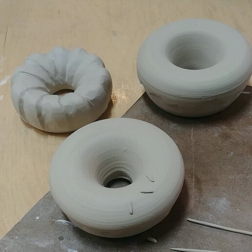

So, why donuts?  I feel that donuts are a universally regarded as a happy treat.  I wanted to take something that lasts mere seconds (at least when I get my hands on them) and set them in ceramic to last a lifetime.  I’ve sculpted and shaped each donut into ones with sprinkles, abstract designs and inspiration from the French cruller (my personal favorite)!

## Here’s the process

### 1. Each donut starts as a mound of clay approximately 1 lb in weight

### 2. They then get centered on a wheel before it gets opened up

### 3. After getting centered, the mound is then opened up all the way through to the bottom of the wheel

### 4. Two wall are then brought up carefully

### 5. And then lifted evenly so they can then be collared

### 6. Collaring is where it starts to get difficult and I lost a few pieces at this stage

### 7. Closing the two walls together is a magical feeling and I guess that’s why I made so many of them! To feel that magic over and over again

### 8. Finally, the donut gets a clean-up job before it’s cut off the wheel

### 9. These have been lightly covered with plastic and drying slowly on my shelf for a bout a week

### 10. Waiting to get trimmed

### 11. Sculpting and adding sprinkles

### 12.  Glazed and ready!

